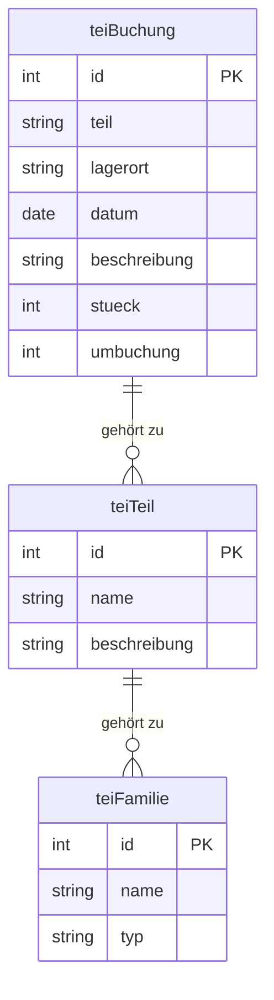

# Datenmodell BVA

## Teile

### Tabelle teiTeil

|Name|Typ|Beschreibung|
|-------:|--------|:-------:|
|Teil |Text   | Bezeichnung des Teils  |
|Beschreibung   |Text|beschreibender Text  |
|min|Zahl|Mindestbestand|
|max|Zahl|Maximalbestand|
|Familie|Text|Zuordnung zu teiFamilie|
|Bild|Text|Text|Zuordnung zu Bild|
|Geloescht|Flag|Kennzeichen, ob Datensatz deaktiviert wurde|

Beziehungen:
1-n Beziehung zu teiFamilie

### Tabelle teiFamilie

|Name|Typ|Beschreibung|
|-------:|--------|:-------:|
|Familie |Text   | Bezeichnung der Familie  |
|Geloescht|Flag|Kennzeichen, ob Datensatz deaktiviert wurde|

Beziehungen:
n-1 Beziehung zu teiTeil

### Tabelle teiBuchung

|Name|Typ|Beschreibung|
|-------:|--------|:-------:|
|ID |Zahl   | technischer Schlüssel  |
|Teil|Text| Referenz auf Teil in teiTeil|
|Lagerort|Text|Referenz auf Lagerort|
|Datum|Datum|Datum der Buchung|
|Beschreibung|Text| beschreibenden Text zu der Buchung|
|Stueck|Zahl|Anzahl der Teile, die entnommen wurden, negativ Ausbuchung|
|Umbuchung|Flag|Umbuchungs Flag|

## Auftrag

## ER-Diagramm

