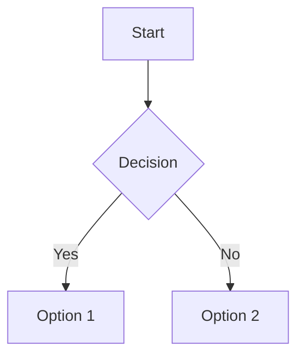

# Test Überschrift

1. Aufzählung
2. zweiter Punkt
3. Punkt

Tablle kommt jetzt

```C
test++;
```

## Tabelle mit Kopf

|Header1|Header2|Header3|
|-------:|--------|:-------:|
|Thomas |Vater   | 1,72  |
|Jule   |Thochter|1,73  |

- [x] Erledigt
- [ ] Offen

**fett**
*kursiv*
~~durch~~

> Zitat adsfasdfasdfasdf
> sfdgsdfgsdfgsdfgsdfgsdfg
> sdfgsdfgdfgsdfgsdfgsdfgsdfg

[Datei mit Bild](TestBild.md)

## Mermaid Diagram




